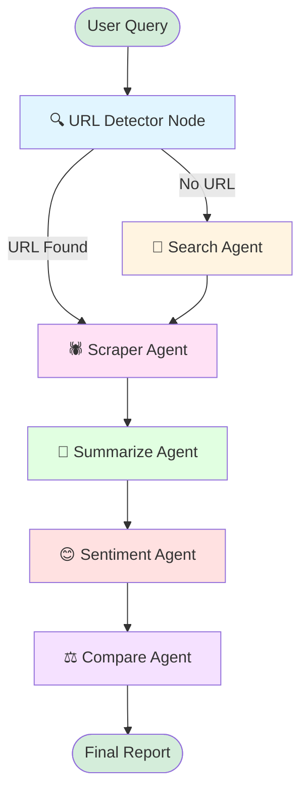
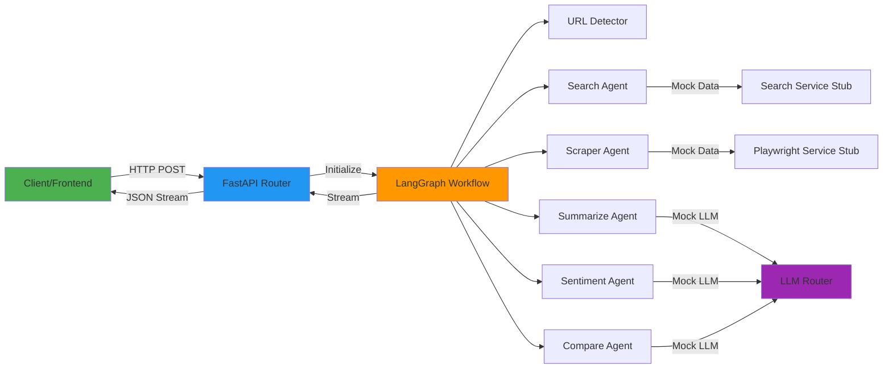

# 🛍️ E-Commerce Research Agent - Architecture Overview

## 📊 LangGraph Workflow Diagram



## 🏗️ System Architecture



## 📦 Project Structure

```
backend/
├── app/
│   ├── __init__.py
│   ├── main.py                      # FastAPI app entry point
│   ├── config.py                    # Settings & environment config
│   ├── dependencies.py              # Dependency injection
│   │
│   ├── routers/
│   │   ├── __init__.py
│   │   └── research_router.py       # /api/research endpoints
│   │
│   ├── agents/
│   │   ├── __init__.py
│   │   ├── graph.py                 # LangGraph workflow definition
│   │   ├── llm_router.py            # LLM model selection & routing
│   │   │
│   │   └── nodes/
│   │       ├── __init__.py
│   │       ├── url_detector.py      # Detects URLs in queries
│   │       ├── search_agent.py      # Searches for product URLs
│   │       ├── scraper_agent.py     # Scrapes product pages
│   │       ├── summarize_agent.py   # Generates summaries
│   │       ├── sentiment_agent.py   # Analyzes sentiment
│   │       └── compare_agent.py     # Compares alternatives
│   │
│   ├── schemas/
│   │   ├── __init__.py
│   │   ├── research_request.py      # Request validation
│   │   └── research_response.py     # Response models
│   │
│   ├── services/
│   │   ├── __init__.py
│   │   ├── playwright_service_stub.py  # Mock web scraping
│   │   └── search_service_stub.py      # Mock search API
│   │
│   └── utils/
│       ├── __init__.py
│       ├── stream.py                # Streaming utilities
│       └── text_cleaner.py          # Text processing
│
├── .env.example                     # Environment template
├── requirements.txt                 # Python dependencies
├── run.sh                          # Server startup script
├── test_api.py                     # API test script
└── README.md                       # Documentation
```

## 🔄 Agent Workflow Details

### 1️⃣ URL Detector Node
- **Input**: User query
- **Process**: Regex-based URL detection
- **Output**: Sets `url` or `needs_search` flag

### 2️⃣ Search Agent Node
- **Trigger**: When `needs_search = True`
- **Process**: Calls search service stub
- **Output**: List of product URLs

### 3️⃣ Scraper Agent Node
- **Input**: Product URL
- **Process**: Calls Playwright service stub
- **Output**: Product data (title, price, rating, features)

### 4️⃣ Summarize Agent Node
- **Input**: Product data
- **Process**: LLM-based summarization
- **Output**: Product summary text

### 5️⃣ Sentiment Agent Node
- **Input**: Product data & reviews
- **Process**: LLM-based sentiment analysis
- **Output**: Sentiment scores & breakdown

### 6️⃣ Compare Agent Node
- **Input**: Product data
- **Process**: LLM-based comparison
- **Output**: Comparison with alternatives

## 🚀 API Endpoints

### Streaming Research
```http
POST /api/research
Content-Type: application/json

{
  "query": "research this product: Apple AirPods 4",
  "mode": "product-analysis"
}
```

**Response**: NDJSON stream with step-by-step updates

### Synchronous Research
```http
POST /api/research/sync
Content-Type: application/json

{
  "query": "Apple AirPods 4",
  "mode": "product-analysis"
}
```

**Response**: Complete research report JSON

### Health Check
```http
GET /api/research/health
```

## 🔧 Configuration

### Environment Variables
- `OPENAI_API_KEY` - OpenAI API key (optional)
- `ANTHROPIC_API_KEY` - Anthropic API key (optional)
- `SERP_API_KEY` - Search API key (optional)
- `DEBUG` - Enable debug mode (default: True)

### CORS Origins
Configured in `config.py`:
- `http://localhost:3000`
- `http://localhost:8000`
- `http://127.0.0.1:3000`
- `http://127.0.0.1:8000`

## 🧪 Testing

Run the test script:
```bash
python test_api.py
```

This will test:
- Health check endpoint
- Streaming research endpoint
- Synchronous research endpoint

## 📝 State Management

The `ResearchState` TypedDict tracks:
```python
{
    "query": str,                    # Original query
    "url": str | None,               # Product URL
    "needs_search": bool,            # Search flag
    "search_results": list | None,   # Search results
    "raw_html": str | None,          # Raw HTML
    "product_data": dict | None,     # Scraped data
    "summary": str | None,           # Summary text
    "sentiment": dict | None,        # Sentiment analysis
    "comparison": dict | None        # Comparison data
}
```

## 🎯 Next Steps for Production

1. **Replace Stubs**:
   - Implement real Playwright scraping
   - Integrate actual search API (SerpAPI, Google Custom Search)
   - Connect real LLM APIs (OpenAI, Anthropic)

2. **Add Persistence**:
   - Database for research history
   - Caching layer (Redis)
   - User authentication

3. **Enhance Agents**:
   - Multi-product comparison
   - Price tracking
   - Review analysis
   - Image analysis

4. **Monitoring**:
   - Logging (structlog)
   - Metrics (Prometheus)
   - Tracing (OpenTelemetry)

5. **Deployment**:
   - Docker containerization
   - Kubernetes orchestration
   - CI/CD pipeline
